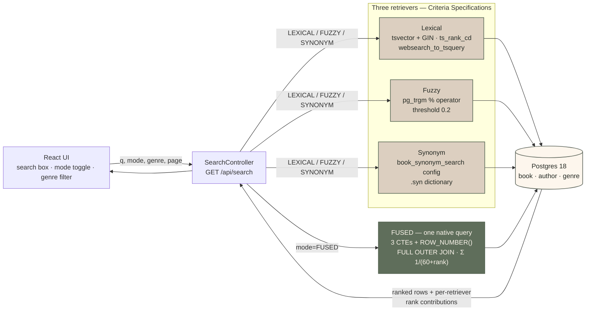

<p align="center">
  <a href="https://github.com/lukas-grigis/spring-postgres-fts/actions/workflows/build.yml"></a>
  
  
  
  
  
</p>

<h1 align="center">Spring Boot Postgres Full-Text Search</h1>

<p align="center">
  Lexical, fuzzy and synonym search over Postgres — plus Reciprocal Rank Fusion of all three —
  reached from the JPA Criteria API, dropping to native SQL at exactly one visible place.<br>
  77 public-domain classics, one endpoint, one page.
</p>

Three things this repo established against a live server, each pinned by a test:

- Hibernate renders an **unregistered** `cb.function("ts_rank", …)` straight through as `ts_rank(?, ?)`. Only the `@@`
  and `%` **operators** need registering — most tutorials register the functions too, and none of it is necessary.
- **Postgres 18 changed generated columns to `VIRTUAL` by default**, and a virtual column cannot be indexed. Omit
  `STORED` and you lose the index, not the column — which is a confusing way to find out.
- A synonym pair listed in **both** directions is self-cancelling. The substitution runs at index time as well as
  query time, so both sides swap to the other word and still never meet.

<p align="center"><a href="https://lukasgrigis.dev/blog/spring-boot-postgres-full-text-search/"><strong>Read the companion blog post &rarr;</strong></a></p>

<p align="center">
  
</p>

---

## The problem

Most "Postgres full-text search with Spring" posts stop at `@Query(nativeQuery = true)` with the query text pasted into
a `WHERE` clause, and never touch ranking, highlighting, or the Criteria API. That leaves three questions unanswered,
and this repo answers them against real Postgres:

1. **Can Criteria reach `@@`, `ts_rank`, `ts_headline` and `similarity()` at all?** Partly for free, and the split is
   the interesting part. Hibernate renders an unregistered
   `cb.function("ts_rank", ...)` straight through as `ts_rank(?, ?)`, so plain functions need no setup at all. `@@` and
   `%` are operators, with no function-call form for it to fall through to — those need
   `FunctionContributor.registerPattern`, and only those. Most posts that mention Hibernate function registration still
   teach the pre-6.0 `MetadataBuilderContributor` route.
2. **Does Spring Data JPA 4's newer `PredicateSpecification` replace classic `Specification` for ranked search?** No.
   `PredicateSpecification.toPredicate` takes `(From<?, T>, CriteriaBuilder)` — no `CriteriaQuery`, and ranking is an
   `ORDER BY`, which only `CriteriaQuery` exposes. Checked with `javap` against the real jar, not assumed from the docs.
3. **How far can Criteria carry Reciprocal Rank Fusion before it gives up?** RRF needs three ranked candidate sets,
   `ROW_NUMBER() OVER (...)` and a `FULL OUTER JOIN`. Criteria can express none of them. `BookRepository.findFused` is
   the one native query here, and that boundary is left visible rather than hidden behind an abstraction.

New to the Postgres side of this? **[docs/POSTGRES-FTS.md](docs/POSTGRES-FTS.md)** explains
`tsvector`, ranking, `ts_headline`, trigrams, synonym dictionaries and RRF in plain English, with every claim cited to
the manual.

## Quick start

You need [Docker](https://docs.docker.com/get-docker/) and [mise](https://mise.jdx.dev/). mise provisions Java, Maven,
Node and Python.

```bash
git clone https://github.com/lukas-grigis/spring-postgres-fts.git
cd spring-postgres-fts
mise run demo
```

`mise run demo` builds the app and the frontend, starts Postgres, waits for both to be healthy and serves the UI.
`Ctrl+C` stops everything, including Postgres.

| Port                    | What's there         |
|-------------------------|----------------------|
| `:5173`                 | the frontend         |
| `:8080/api/search`      | the search API       |
| `:8080/swagger-ui.html` | interactive API docs |
| `:8080/actuator/health` | health               |

Then try these, which each make one retriever earn its place:

| Query         | Mode    | Why it is interesting                               |
|---------------|---------|-----------------------------------------------------|
| `whale`       | Lexical | ordinary stemmed match                              |
| `Shakespere`  | Fuzzy   | misspelt; the stemmer cannot reach it, trigrams can |
| `casement`    | Synonym | no book contains the word, six are returned anyway  |
| `great house` | Fused   | see which retriever found what, and at what rank    |

Individual tasks:

```bash
mise run infra:up       # Postgres, host port 5432
mise run build          # package the app + build the frontend
mise run app            # java -jar target/spring-postgres-fts.jar
mise run frontend:dev   # frontend dev server, proxies /api to :8080
mise run test           # backend suite (Testcontainers — no infra:up needed)
mise run frontend:check # frontend lint, format check and unit tests
mise run check          # probe a RUNNING app: health, all four modes, bad input
mise run seed           # regenerate the corpus from Project Gutenberg
```

`mise run test` and `mise run check` answer different questions. The first runs the retrievers
against a throwaway container; the second curls the packaged jar over HTTP and asserts every
example query below still returns a non-empty result set — which is what catches a demo that
suggests a query the corpus can no longer answer.

## Architecture



One request, end to end, naming the file at each hop:

1. **`SearchController.search`** binds `q`, `mode`, `genre` and a `Pageable`, rejects a blank query and an unreachable
   page, and drops any `sort` — relevance ordering is the retriever's.
2. **`SearchService.search`** branches on the mode, and that branch is the whole architecture.
3. *Three retrievers* — **`BookSearchExpressions`** supplies the predicate, the rank expression and the headline;
   `SearchService` assembles them into one `CriteriaQuery` and selects into `SearchResult` with `cb.construct`. The
   `cb.function("fts", …)` call becomes the SQL `?1 @@ ?2` via **`SearchFunctionContributor`**, which is the only
   reason `@@` is reachable from Criteria at all.
4. *Or FUSED* — **`BookRepository.findFused`**, one native query. Rows arrive as the **`FusedSearchRow`** interface
   projection, and `SearchService.toResult` attaches each retriever's rank.
5. `PagedModel` on the wire → `api/client.ts` → `useSearch` → `ResultList` / `ResultCard` → `sanitizeHeadline` → the
   `<mark>`s you see.

The package layout follows that boundary:

```
dev.lukasgrigis.booksearch
├── domain/            BookEntity, AuthorEntity, GenreEntity — mapping only
├── search/            SearchService, BookSearchExpressions, repositories, result records
│   └── hibernate/     SearchFunctionContributor — the SPI that makes @@ reachable
└── web/               SearchController
```

Dependencies run one way, `web → search → domain`. `SearchFunctionContributor` gets its own package because it is not
application code: it is loaded by `META-INF/services` before the Spring context exists, and it is the piece most readers
come here for.

Three retrievers run as three `Specification<BookEntity>` chains, composed with `hasGenre` via
`Specification.and`, selected into `SearchResult` with `cb.construct`. `SearchService` builds that
`CriteriaQuery` itself rather than going through `JpaSpecificationExecutor`, because score and headline are computed SQL
expressions rather than mapped attributes — a Spring Data projection has nothing on the entity to read them from, and
the `ORDER BY` over the rank needs a `CriteriaQuery`
anyway. `mode=FUSED` skips all three and calls the native RRF query.

Paging is Spring Data's throughout: `Pageable` in, `Page` through the service, `PagedModel` on the wire. The native
query pages through its own `countQuery`, which is meaningful here because each retriever's candidate set is capped, so
the fused set is bounded.

## What the tests pin down

Thirty-six tests against a real Postgres — no mocked database anywhere. The findings worth knowing before you read the
code:

| Finding                                                                                                                                                                                               | Test                                                                                                                                |
|-------------------------------------------------------------------------------------------------------------------------------------------------------------------------------------------------------|-------------------------------------------------------------------------------------------------------------------------------------|
| Hibernate renders an **unregistered** `cb.function` name straight through as `name(args)`, so only the `@@` and `%` *operators* need `registerPattern` — not `ts_rank`, `ts_headline` or `similarity` | [`FunctionContributorIT`](src/test/java/dev/lukasgrigis/booksearch/search/hibernate/FunctionContributorIT.java)                     |
| A synonym pair listed in **both** directions is self-cancelling: the substitution runs at index time as well as query time                                                                            | [`GeneratedColumnAndSynonymDirectionIT`](src/test/java/dev/lukasgrigis/booksearch/search/GeneratedColumnAndSynonymDirectionIT.java) |
| Postgres 18 made generated columns `VIRTUAL` by default, and a virtual column cannot carry an index                                                                                                   | [`GeneratedColumnAndSynonymDirectionIT`](src/test/java/dev/lukasgrigis/booksearch/search/GeneratedColumnAndSynonymDirectionIT.java) |
| `ts_headline` does not escape its input, so the excerpt is escaped *before* it runs                                                                                                                   | [`HeadlineIT`](src/test/java/dev/lukasgrigis/booksearch/search/HeadlineIT.java)                                                     |
| RRF surfaces a book that is #1 in no single retriever                                                                                                                                                 | [`FusedRankingIT`](src/test/java/dev/lukasgrigis/booksearch/search/FusedRankingIT.java)                                             |
| Every shipped synonym pair reaches a real seeded book — a pair whose target is missing matches nothing and looks identical to a broken feature                                                        | [`SynonymDictionaryCorpusIT`](src/test/java/dev/lukasgrigis/booksearch/search/SynonymDictionaryCorpusIT.java)                       |
| `ts_rank` and `ts_rank_cd` genuinely disagree on this corpus                                                                                                                                          | [`RankOrderingIT`](src/test/java/dev/lukasgrigis/booksearch/search/RankOrderingIT.java)                                             |
| A trigram match finds a misspelled author the stemmer structurally cannot                                                                                                                             | [`FuzzySearchIT`](src/test/java/dev/lukasgrigis/booksearch/search/FuzzySearchIT.java)                                               |

Everything asserting Postgres behaviour runs in a `@DataJpaTest` slice against a real container; only the HTTP contract
needs `@SpringBootTest`, over MockMvc rather than a servlet container. There is no mocked database anywhere, so **Docker
is required even for `mise run test`** — one container starts per JVM and `book_synonym.syn` is copied into it before
Liquibase creates the dictionary.

## The corpus

77 public-domain English classics, pulled from Project Gutenberg by a committed script ([
`support/seed/fetch_seed.py`](support/seed/fetch_seed.py)) and curated so the demos are honest:
typo-prone author names for the trigram retriever, prose long enough that `ts_rank` and
`ts_rank_cd` genuinely disagree, and vocabulary the synonym dictionary can actually reach. Excerpts are real work text,
verified against the Gutendex API, and a work that fails verification is dropped rather than guessed at. The provenance
rules are in
[`support/seed/README.md`](support/seed/README.md).

Genres are whatever the corpus produced; the frontend fetches them from `GET /api/genres` rather than hardcoding a list
that can drift.

## Limits

Where this approach ends, stated so nobody discovers it in production:

- **This is not BM25.** `ts_rank` and `ts_rank_cd` score a row from that row's `tsvector` alone. Postgres FTS keeps **no
  corpus-wide statistics**, so there is no inverse-document-frequency term:
  a word in 2 of 77 books weighs the same as one in 70.
- **There is no reranker in the database.** RRF is rank arithmetic. It fuses positions and knows nothing about relevance
  beyond them. A cross-encoder or LLM reranker would be a stage after this repo ends, as are pgvector and embeddings.
- **FUZZY does not use an index.** Its predicate ORs across `book` and `author`, and no single-table index can answer
  that, so it scans both at any size. Fine at 77 rows; the first thing to rethink at scale.
- **The synonym dictionary is not inflection-aware.** `apothecaries` misses an `apothecary` key, so SYNONYM is not a
  superset of LEXICAL. The `thesaurus` template is the documented fix and is deliberately not implemented —
  see [docs/POSTGRES-FTS.md](docs/POSTGRES-FTS.md).
- **Sorting is not yours to choose.** The endpoint takes a `Pageable`, so Spring binds a `sort` parameter whether or
  not this API wants one. `SearchController` drops it explicitly rather than passing it on: relevance ordering belongs
  to the retriever, and FUSED is a native query, where Spring Data would splice an unparsed sort into the SQL text.
- **There is no production serving story for the frontend.** `frontend:build` is a typecheck-and-bundle gate; the demo
  serves through the Vite dev server, and its `/api` proxy is standing in for a CORS decision nobody has had to make.

## License

[MIT](LICENSE)
